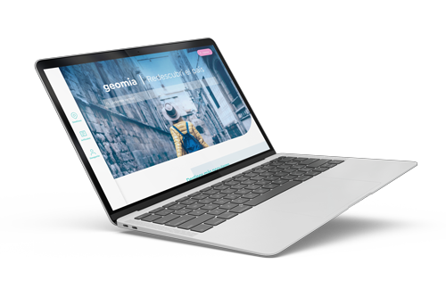

<p align="center">
    <a href="https://geomia.netlify.app" target="_blank">
        
    </a>
</p>
<p align="center">
    <a href="https://app.netlify.com/sites/geomia/deploys" target="_blank">
        
    </a>&nbsp;
    
</p>
<p align="center">
    
</p>

**Geomia** is part of a fictitious project for our capstone in Multimedia Design degree. It's a webapp for travel and review information about destinations in argentinian territory. Made w/ **Vue.js** and **Vuetify** framework.

[✈️ Visit website](https://geomia.netlify.app)

## Project setup
```
npm install
```

### Compiles and hot-reloads for development
```
npm run serve
```

### Compiles and minifies for production
```
npm run build
```

### Lints and fixes files
```
npm run lint
```

### Customize configuration
See [Configuration Reference](https://cli.vuejs.org/config/).
